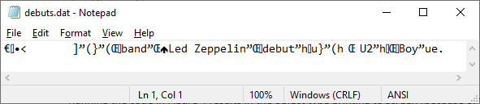
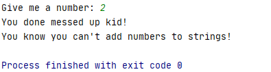
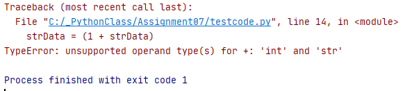
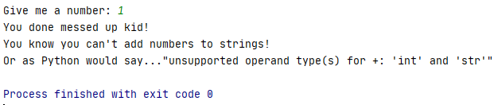

Nathaniel Smith  
June 1, 2020  
Foundations of Programming: Python (IT FDN 100 A Sp 20)  
Assignment07  


# Python: Pickling Data and Exception Handling
## Introduction
In this paper I will explain how to pickle (and unpickle) objects and how to handle exceptions in Python.  
## What is pickle?
pickle is a Python module. As such, it must be imported with the import statement, see Figure 1.
```
import pickle
```
#### *Figure 1. Importing the pickle Module*
pickle is used to serialize or de-serialize Python objects. Some objects that can be serialized with the pickle module include, but are not limited to, None, True, False, integers, floats, strings, tuples, lists, and dictionaries. “pickling” is the conversion of objects into byte streams and “unpickling” is the conversion of byte streams into objects according to the official Python documentation (https://docs.python.org/3/library/pickle.html) (external site).
## Why pickle?
The pickle module is very useful, and efficient, at writing objects into binary files and reading objects from binary files. For example, it can be used to save a user’s updated profile to a database, or to save the state of a program at close so that the program can continue from the stop point after restarting.
## How Do You Pickle?
It’s easy to pickle, especially if you are familiar with reading and writing strings to plain text files. First, you need to open an object file with the open() function, but you have to open the object file with access mode ‘wb’. The b stands for binary. See the example in Figure 2.
```
pickling = open("debuts.dat", "wb")
```
#### *Figure 2. Open an Object File with Mode 'wb'*
Next, you write a Python object to the binary file using the pickle.dump() function. This step is the serialization process. In my example, I assigned a list of dictionary elements to the variable debutAlbums. The list object is then written to the binary object file pickling. See the example in Figure 3.
```
pickle.dump(debutAlbums,  pickling)
```
#### *Figure 3. pickle.dump() Function*
Finally, you close the file with the .close() function. The above steps are shown together in Figure 4.
```
import pickle

debutAlbums = [{'band': 'Led Zeppelin', 'debut': 'Led Zeppelin'},  # create a list object
               {'band': 'U2', 'debut': 'Boy'}]

# pickling an object
pickling = open("debuts.dat", "wb")  # open a binary file for writing
pickle.dump(debutAlbums, pickling)  # serialization i.e. pickling
print(type(pickling))
pickling.close()  # close the file
```
#### *Figure 4. Pickling an Object*
Running the code in Figure 4 results in the object type printing to screen (because of the print statement, which I did not mention earlier) and writing the object debutAlbums to the debuts.dat file. The class type of pickling is _io.BufferedWriter. The debuts.dat file is shown in Figure 5.  


#### *Figure 5. debuts.dat Binary File*
The debuts.dat binary file is not human readable. I can pick out a few words, but most of the characters make sense to me. This is how binary files are stored. It is completely readable by the computer. Do not confuse this with the file being encrypted. Because anyone can unpickle the contents of the file to read it. And that is what I explain next.
## How do you Unpickle?
Unpickling is just as easy as pickling. First, the pickle module is imported. Second, a binary object file is opened with the open() function, but this time with access mode ‘rb’. Finally, the pickle.load() function is used to unpickle the file into a variable i.e. de-serialize the data in the file into an object. This code is shown in Figure 6.
```
import pickle

# unpickling an object
unpickling = open("debuts.dat", "rb")  # open binary file for reading
debutAlbumsUP = pickle.load(unpickling)  # de-serialization i.e. unpickling
unpickling.close()  # close the file
```
#### *Figure 6. Unpickling an Object*
To see what is stored in debutAlbumsUP I use the print() function. I also use a print function to check that the data type is list which is what I am expecting because I initially started with a list of dictionary elements, debutAlbums, that was pickled and then unpickled.
```
print(debutAlbumsUP)  # print to check that it worked
print(type(debutAlbumsUP))  # check the data type
```
#### *Figure 7. Print() Functions*
The print statements of Figure 7 printed the text shown in Figure 8. Indeed, the original list was printed to screen and debutAlbumsUP is type list.
 Function")
#### *Figure 8. Result of print() Function in Figure 7*
## Additional Resources on Pickle
Here is a list of additional resources that discuss pickling and unpickling:  
•	https://www.youtube.com/watch?v=2Tw39kZIbhs (external site) – great introduction to pickle  
•	https://docs.python.org/3/library/pickle.html (external site) – all the ins and outs of pickle  
•	https://www.geeksforgeeks.org/understanding-python-pickling-example/ (external site) – provides a nice example of pickling without a file  
## Exception Handling
Exception handling is a way to handle errors that arise during the execution of code. Errors can result because of bad user inputs, or missing files, or bad programming. There are many reasons that an error might occur. If an error occurs in a script that does not have exception handling, the script will exit with an error and print the error to the screen that is not usually understood by the user. Exception handling is a way to capture these errors, provide useful messages to the user, and allow the program to continue running. In Python, we use the try statement to handle exceptions.
## Try Statement
A try statement consists of a try clause and an except clause. And there can be multiple except clauses. The try clause begins with the keyword “try” followed by a colon, followed by an indented block of code. It is in this indented block that you place code to be “checked” for errors. The code in the block will try to run. If there are no exceptions the code will execute as intended. If an error is encountered the script will jump to the except clause.
## Except Clause
The except clause begins with the “except” keyword, followed by named exceptions, followed by a colon, followed by an indented block of code. The script will check if the named exception or exceptions of the except clause matches the exception from the try clause. If so, the block statement of the except clause will execute. This behavior is similar to if-else statements in that only the first else statement that evaluates to True executes; the others will be skipped even if they would evaluate to True. Similarly, In the try statement, only the first except clause to have a match executes. If there are no matching except clauses the script will exit with an error just as it would if there had been no try statement.
## Try Statement Example
Let’s take a look at the simple try statement in Figure 9.
```
try:
    strData= input("Give me a number: ")
    strData = (1 + strData)
except Exception:
    print("You done messed up kid!")
    print("You know you can't add numbers to strings!")
```
#### *Figure 9. Simple Try Statement*
The try block will ask the user to input a number and then tries to add 1 to the variable strData. Because strData will always be a string, even if the user entered a number, and because you cannot add integers to strings, this will cause an error. The except clause will handle this error. The named exception is Exception and this is the built-in common base class for all non-exit exceptions. Meaning that this clause will match all built-in exception types. Figure 10 shows the result of running this code in PyCharm.

#### *Figure 10. Running Try-Except*
## Error Message
Running the code outside of the try statement results in the error message shown in Figure 11.

#### *Figure 11. TypeError Error Message*
## Matching Exception Types
Now I am going to spruce up the code a bit from Figure 9, see Figure 12 below.
```
try:
    strData= input("Give me a number: ")
    strData = (1 + strData)
except TypeError as e:
    print("You done messed up kid!")
    print("You know you can't add numbers to strings!")
    print(f'Or as Python would say..."{e}"')
except Exception:
    print('an error occurred...be careful.')
```
#### *Figure 12. Try Statement with Two Except Clauses*
I added a new exception clause to check if the named exception type is TypeError. I know from running the faulty code that it will generate a TypeError error. I still have the except clause that checks for a match to any exception belonging to the base class Exception. This clause is intentionally at the end of the try statement as it will only execute if the error does not match TypeError. Let’s see the code in action, see Figure 13.

#### *Figure 13. Try Statement in Action*
I added a little something extra to this that I did not already mention. I used the as clause in the first except statement to associate the exception being passed to the name e and then I used the name e in a print statement to print some useful information about the exception.
## Else Clause
The try statement can also have an else clause. The else clause will only execute if the block statement of the try clause has no errors. This is a great place to put code that is not expected to trigger any errors like the code being “checked” in the try clause.
## Finally Clause
A finally clause will execute no matter what. If no exception is raised, the finally clause is executed. If an exception is raised, the finally clause will execute. I do not yet see how this is useful, but I did add it to my code.
## Raise an Exception
It is also possible to raise an exception with the raise statement. See the code in Figure 14.
```
try:
    strData= input("Give me a number: ")
    if not strData.isnumeric(): 
        raise ValueError('Give me a number, please.')  # raise ValueError
except TypeError as e:
    print("You done messed up kid!")
    print("You know you can't add numbers to strings!")
    print(f'Or as Python would say..."{e}"')
except ZeroDivisionError as e:
    print("Don't worry, it's not you it's me.")
    print("I guess I should write better code.")
    print(f'Python had this to say about it, "{e}"')
except ValueError as e:
    print("Why you messing with me?")
    print(f"I asked for a number and you give me '{strData}'?!")
    print(f'This is what Python thinks about it: "{e}"')
except Exception as e:
    print(e)
else:
    print('We had no errors!')
finally:
    print('Errors or not, this will execute.')
```

#### *Figure 14. Raise Exception*
If the user does not enter a number, the raise statement is executed which forces the ValueError exception to occur. And the statement “Give me a number, please.” gets passed to ValueError. Figure 15 shows what happens if you run the code and the user does not enter a number.


## Summary
