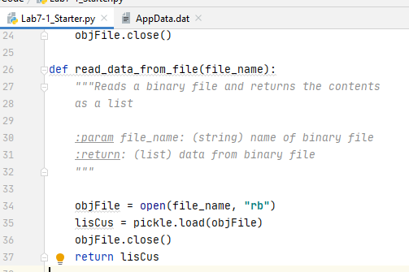

Nathaniel Smith  
June 1, 2020  
Foundations of Programming: Python (IT FDN 100 A Sp 20)  
Assignment07  


# Python: Pickling Data and Exception Handling
## Introduction
In this paper I will explain how to pickle (and unpickle) objects and how to handle exceptions in Python.  
## What is pickle?
pickle is a Python module. As such, it must be imported with the import statement, see Figure 1.
```
import pickle
```
#### *Figure 1. Importing the pickle Module*
pickle is used to serialize or de-serialize Python objects. Some objects that can be serialized with the pickle module include, but are not limited to, None, True, False, integers, floats, strings, tuples, lists, and dictionaries. “pickling” is the conversion of objects into byte streams and “unpickling” is the conversion of byte streams into objects according to the official Python documentation (https://docs.python.org/3/library/pickle.html) (external site).
## Why pickle?
The pickle module is very useful, and efficient, at writing objects into binary files and reading objects from binary files. For example, it can be used to save a user’s updated profile to a database, or to save the state of a program at close so that the program can continue from the stop point after restarting.
## How Do You Pickle?
It’s easy to pickle, especially if you are familiar with reading and writing strings to plain text files. First, you need to open an object file with the open() function, but you have to open the object file with access mode ‘wb’. The b stands for binary. See the example in Figure 2.
```
pickling = open("debuts.dat", "wb")
```
#### *Figure 2. Open an Object File with Mode 'wb'*
Next, you write a Python object to the binary file using the pickle.dump() function. This step is the serialization process. In my example, I assigned a list of dictionary elements to the variable debutAlbums. The list object is then written to the binary object file pickling. See the example in Figure 3.
```
pickle.dump(debutAlbums,  pickling)
```
#### *Figure 3. pickle.dump() Function*
Finally, you close the file with the .close() function. The above steps are shown together in Figure 4.
```
import pickle

debutAlbums = [{'band': 'Led Zeppelin', 'debut': 'Led Zeppelin'},  # create a list object
               {'band': 'U2', 'debut': 'Boy'}]

# pickling an object
pickling = open("debuts.dat", "wb")  # open a binary file for writing
pickle.dump(debutAlbums, pickling)  # serialization i.e. pickling
print(type(pickling))
pickling.close()  # close the file
```
#### *Figure 4. Pickling an Object*
Running the code in Figure 4 results in the object type printing to screen (because of the print statement, which I did not mention earlier) and writing the object debutAlbums to the debuts.dat file. The class type of pickling is _io.BufferedWriter. The debuts.dat file is shown in Figure 5.  


## Summary


**Dev:** *NSmith*  
**Date:** *1.1.2020*  


```
Add code here
```
#### Listing 1  


#### Figure 1. The code from lab 07  

#### Figure 1. The code from lab 07  

#### Figure 1. The code from lab 07 
